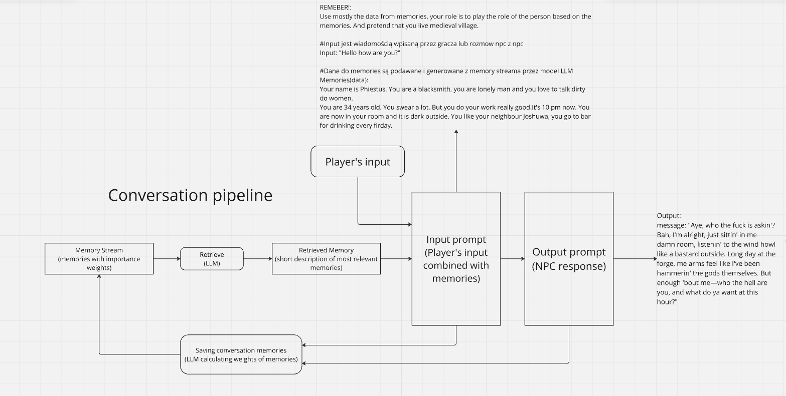

# Meeting Summary - March 12

During the meeting, we agreed on the conversation pipeline, the format of the prompts, and the method of storing the agent's memory, which will influence the responses. At this stage, we still need to test which model will generate the most satisfactory answers for our prompts (currently, we are choosing between: GPT-2, Mistral 7B, Deepseek R1 7B, and Llama 2). Before this meeting, each team member conducted research, with one of the main sources being the following article: [https://arxiv.org/pdf/2304.03442.pdf](https://arxiv.org/pdf/2304.03442.pdf)


## Detailed Description of the Diagram

### Memory Stream:

- Data will be stored in a `.xml` (or `.json`) file.  
  Example file format:

    ```xml
    <information>
      first_name: Gerat
      last_name: Z Rivii
      occupation: Witcher
      ....
    </information>
    <memories>
      Yesterday, Roach died (weight 6, calculated by LLM)
      You woke up at 9:00 AM (weight 1, calculated by LLM)
      ....
    </memories>
    <plans>
      #we will define this more precisely when we know the possible actions in the game; these will be generated based on memory weights
    </plans>
    <map>
      #map in tree form:
      root: building
      branches: rooms
      leaves: items in rooms
    </map>
    <parameters>
      fatigue
      hunger
      ....
    </parameters>
    ```

### Retrieve:

- An LLM that, based on memory weights, will select the most important information, generate a description for the `Memories(data)`, and calculate relevance.
- The weights will consist of:
  - `recency` (based on the timestamp of the memory)
  - `importance`
  - `relevance`
  - `retrieve = recency + importance + relevance`

### Retrieved Memory:

- The output of `retrieve` (LLM), which is used as part of the input prompt.

### Player's Input:

- Interaction (dialogue) from the player.

### Input Prompt:

- Combination of `Retrieved Memory` and the player's input.

### Saving Conversation Memories:

- LLM, which will calculate importance.  
  Example prompt:
  
    `"On the scale of 1 to 10, where 1 is purely mundane (e.g., brushing teeth, making bed) and 10 is extremely poignant (e.g., a break-up, college acceptance), rate the likely poignancy of the following piece of memory. Memory: buying groceries at The Willows Market and Pharmacy Rating:"`

## List of Participants:

- Maciej Włudarski
- Maciej Pitucha
- Karol Rzepiński
- Kamil Włodarczyk
- Łukasz Jastrzębski
- Michał Eisler
- Łukasz Czarzasty
