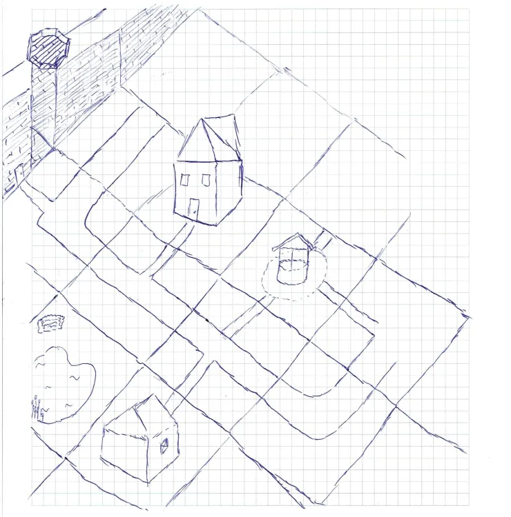

# Meeting Summary - March 05

# Character Archetypes:
- Six main LLM character archetypes have been defined (e.g., Grim, Joyful, Sad, Crazy, etc.).

# Dynamic Job Assignment:
- Jobs are dynamically assigned in prompts rather than being permanently defined in the dataset.
- This approach allows for adding new buildings assigned to specific jobs in the final stage of the project.

# Supervisor Responsibilities:
- The Supervisor should generate the initial prompt for each NPC at the beginning of the game.
- In the second semester, its functionality can be expanded to generate random events.

# Proposed Buildings:
- Well
- Mill
- Blacksmith
- Farm
- Lord's building
- Potter's workshop
- Tavern/Inn
- Church (Priest)
- Cemetery
- Bathhouse
- Market
- Infirmary
- Dungeon
- Gallows

Additionally, we have found software for modeling buildings in Unity, which also includes free assets.

---

# List of Meeting Attendees:
- Cyprian Zasada
- Marek Nijakowski
- Paweł Dolak
- Paweł Reich
 
