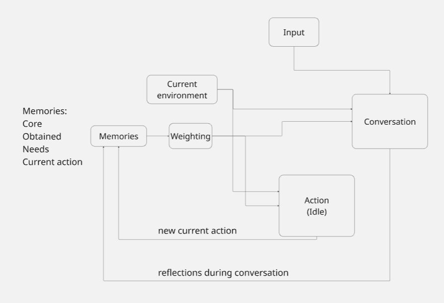

## IDLE PROMPT STRUCTURE

### Prompt structure
**Input:**

**core memories:** These are facts or truths that are always known and universally valid.
**obtained memories:** These are acquired memories whose weight depends on importance, relevance and recency factors.
**current environment:** Describes NPC's surroundings. Where it is, what objects are around and how far they are.
**needs:** Simple needs such as sleep and hunger. Its weights span from 1 to 3.
**stopped action:** Action which was performed at the time of the prompt. NPC should continue that action if there is not anything more important at the moment.


**Output:** 


**new action:** New action NPC will perform. Could be the same as the one in stopped action.

---
### Unity memory injections
When NPC is moving throughout the game world, Unity game engine makes deterministic memory injections. They are triggered by specific situations, such as detecting other NPC in determined radius (which coresponds to "Met Ivor at the tavern" memory). Second case would be registering a start and end of performed actions. That way, NPC will be "aware" of its current state adding more flavour and dynamic to conversations.

---
### Resources
#### Decision system macro pipeline


#### Example prompt template
```
You are an NPC decision-making agent in an *idle* state. Your task is to **choose only one most appropriate action** from the list available in `current_environment`. The decision must follow the rules below:

=== RULES ===

1. Core Memories  
These are general truths that are always valid. Example: "Humans need food", "Talking improves relationships". Treat them as universal logic principles.

2. Obtained Memories  
These are learned memories (e.g. past events, observations, other characters' reactions). Their influence depends on the **sum of their weights** — the higher the total weight, the more they should affect the decision.

3. Current Environment  
A list of possible actions along with their properties (e.g. distance, name). This represents the NPC's surroundings. **Closer actions are more important**. You must pick one of these actions as your output.

4. Needs  
Current needs of the NPC, each with a weight from 1 to 3. The higher the weight, the more urgent the need. A need with weight 3 is a top priority and should strongly influence your choice.

5. Stopped Action  
If there is a recently stopped action, you should aim to resume it — **unless there is a need with weight 3**, or another action in the environment makes significantly more sense based on core/obtained memories or needs.

=== INPUT FORMAT ===

{
    "core_memories": [...],
    "obtained_memories": [
            {"memory": "...", "weight": 1},    {"memory": "...", "weight": 2}
    ],
    "current_environment": [
        {"action": "Go to the campfire", "distance": 3},{"action": "Sit on the bench", "distance": 1},{"action": "Talk to NPC_A", "distance": 2}
    ],
    "needs": [
        {"need": "rest", "weight": 2},
        {"need": "talk", "weight": 1}
    ],
    "stopped_action": "Sit on the bench"
}

=== OUTPUT FORMAT ===

Return only one selected action from the current_environment, for example:

Selected action: Sit on the bench

Do not explain your reasoning. Do not provide a ranked list. Just pick the single most suitable action based on the rules above.
```

#### Example prompt input
```
You are an NPC decision-making agent in an *idle* state. Your task is to **choose only one most appropriate action** from the list available in `current_environment`. The decision must follow the rules below:

=== RULES ===

1. Core Memories  
These are general truths that are always valid. Example: "Humans need food", "Talking improves relationships". Treat them as universal logic principles.

2. Obtained Memories  
These are learned memories (e.g. past events, observations, other characters' reactions). Their influence depends on the **sum of their weights** — the higher the total weight, the more they should affect the decision.

3. Current Environment  
A list of possible actions along with their properties (e.g. distance, name). This represents the NPC's surroundings. **Closer actions are more important**. You must pick one of these actions as your output.

4. Needs  
Current needs of the NPC, each with a weight from 1 to 3. The higher the weight, the more urgent the need. A need with weight 3 is a top priority and should strongly influence your choice.

5. Stopped Action  
If there is a recently stopped action, you should aim to resume it — **unless there is a need with weight 3**, or another action in the environment makes significantly more sense based on core/obtained memories or needs.

=== INPUT FORMAT ===

{
    "core_memories": [
        "I hate this town. Nothing ever happens here, and when it does, it’s just another sad story.",
        "I go on trips every weekend to escape the crushing boredom.",
        "I like Phiestus. He’s the only one around here who doesn’t bore me to tears.",
        "My best friend was murdered. I don’t talk about it unless I’m drunk—or unless you ask.",
        "I drink because it dulls the noise in my head, not because I enjoy it.",
        "I don’t care what people think of me. Most of them don’t think at all."
    ],
    "obtained_memories": [
        {
            "memory": "Someone asked me where to eat in this dump. Told them to try luck fishing or licking the tavern floor.",
            "weight": 11
        },
        {
            "memory": "Saw the blacksmith’s kid staring at the well like it was gonna whisper secrets. Creepy little bastard.",
            "weight": 17
        },
        {
            "memory": "Ran into Phiestus today. He was rambling about some vision he had. Told him I’d believe it if the gods bought me a drink.",
            "weight": 23
        },
        {
            "memory": "Woman near the chapel asked if I’ve ‘seen the light.’ Told her the only light I care about is the sun over the next town.",
            "weight": 14
        },
        {
            "memory": "Someone asked me where to eat in this dump. Told them to try luck fishing or licking the tavern floor.",
            "weight": 11
        },
        {
            "memory": "Heard screaming from the woods last night. Could be a ghost, could be someone stepped on a pinecone. Who knows.",
            "weight": 21
        },
        {
            "memory": "Drank too much at the tavern again. Woke up next to a sheep. Don’t ask. I’m not proud.",     "weight": 25
        },
        {
            "memory": "The innkeeper’s been acting jumpy lately. Like he’s hiding something under that greasy bar.","weight": 19
        },
        {
            "memory": "Spoke to a newcomer. Asked too many damn questions. I gave him advice: 'Don’t die, don’t trust, and don’t stay.'",
            "weight": 27
        },
        {
            "memory": "Sky looked weird this morning. Red sunrise. Probably means the day’s gonna suck.",
            "weight": 13
        },
        {
            "memory": "Thought I saw my dead friend in the crowd today. Just a drunk guy in a hood. Almost punched him anyway.",
            "weight": 30
        }
    ],
    "current_environment": {
        "location": "Outside the tavern, late evening, drizzle in the air, few people passing by.","possible_actions": [
            "enter tavern and get a drink",
            "sit on the barrel and complain about the weather",
            "talk to a random drunkard",
            "stare at the moon and mutter about destiny",
            "go wander the back alleys looking for 'adventure'",
            "grumble loudly until someone notices",
            "check pockets for last coin and consider selling boots",
            "wait for Phiestus to show up"
        ]
    },
    "needs": [
        "escape boredom",
        "avoid meaningful emotional connections",
        "get drunk enough to forget things",
        "rant to someone who won’t walk away",
        "plan the next trip (even if it’s imaginary)",
        "figure out who’s watching him—or if it's just the beer"
    ],
    "stopped_action": "Sit on the bench"
}

=== OUTPUT FORMAT ===

Return only one selected action from the current_environment, for example:

Selected action: Sit on the bench

Do not explain your reasoning. Do not provide a ranked list. Just pick the single most suitable action based on the rules above.
```
Output:
```
enter tavern and get a drink
```

### Meeting Participants
- Karol Rzepiński
- Cyprian Zasada
- Kamil Włodarczyk
- Maciej Pitucha
- Łukasz Czarzasty
- Michał Eisler
- Maciej Włudarski
- Łukasz Jastrzębski  